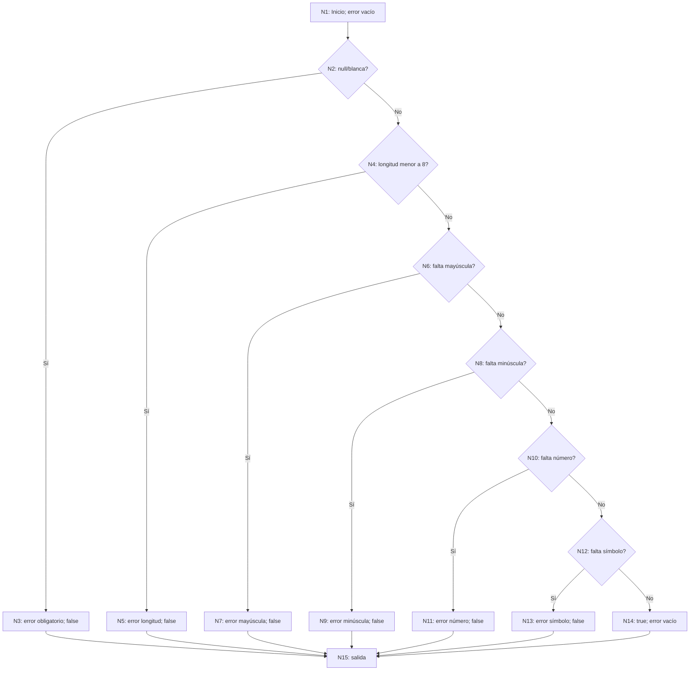

# BLOQUE 12 — Tests académicos

## 1. Objetivo y estrategia

Dejar una batería permanente, reproducible y trazable que demuestre pruebas unitarias, caja negra con partición de equivalencia y valores límite, y caja blanca mediante camino básico. Se seleccionaron reglas existentes; no se cambiaron reglas para facilitar los tests. Esta suite no reemplaza las aceptaciones funcionales de los bloques anteriores ni afirma cobertura total.

Checkpoint inspeccionado: `d1b88b1`. Antes del bloque no existía un proyecto de tests ni tests xUnit/NUnit/MSTest en el repositorio. Los harness temporales anteriores no se contabilizan como pruebas permanentes.

## 2. Niveles, entorno y herramientas

- Unitario: serialización/hashing de integridad y política de contraseñas.
- Unitario de contrato: DataAnnotations de puntuación de CalificacionTrabajo.
- Consistencia de metadatos: modelo EF frente al snapshot, sin conexión SQL.
- No se necesita integración contra una base temporal para los caminos seleccionados. No se ejecuta integración SQL ni navegador en esta suite.
- .NET 8; SDK de ejecución 9.0.312; xUnit 2.9.2, runner Visual Studio 2.8.2 y Microsoft.NET.Test.Sdk 17.11.1. Las versiones están fijadas en el proyecto.

Proyecto: `tests/MecaniCar360.Tests/MecaniCar360.Tests.csproj`, incluido en `MecaniCar360.sln`. Referencia el proyecto productivo. El proyecto web excluye el código y contenido de tests de su compilación/publicación.

No se ejecuta Program, seed o migraciones. No se leen appsettings/User Secrets ni se envía correo. Las entradas de contraseña de los tests son datos ficticios, no cuentas existentes. Las fechas son fijas y el test de cultura restaura la cultura en finally. Cada test construye sus propios objetos; no depende del orden ni de recursos compartidos persistentes.

## 3. Pruebas unitarias de integridad

Código probado: [SerializadorCanonico](../Data/Integridad/SerializadorCanonico.cs). Tests: [SerializadorCanonicoTests](../tests/MecaniCar360.Tests/SerializadorCanonicoTests.cs).

| ID | Entrada/condición | Esperado | Test automatizado |
|---|---|---|---|
| UT-01 | null | `N;` | Token_Null_ProduceMarcadorNulo |
| UT-02 | string vacío frente a null | `V0:;`, DVH distintos | Token_Vacio_SeDistingueDeNull |
| UT-03 | delimitadores en campos y particiones diferentes | Longitud explícita y hashes diferentes | Dvh_DelimitadoresEnCampos_NoConfundeParticiones |
| UT-04 | `ñ🚗` | `V6:ñ🚗;`, seis bytes UTF-8 | Token_TextoMultibyte_CuentaBytesUtf8 |
| UT-05 | 12.5m, 12.50m, 12.5000m | `V5:12.50;` | Token_Decimal_UsaDosDecimalesInvariantes |
| UT-06 | Fecha fija con 7 dígitos fraccionarios y Kind distinto | Representación exacta sin conversión horaria | Token_Fecha_ConservaPrecisionSinConvertirZona |
| UT-07 | Mismos valores con es-AR y en-US | Mismo DVH y decimal invariante | Dvh_CulturasEsArYEnUs_ProduceMismoHash |
| UT-08 | Personas, clave 7, Ana; repetido | SHA-256 conocido versión 1 | Dvh_VectorVersionUno_CoincideConSha256Conocido |
| UT-09 | Claves 7 y 8 con datos iguales | DVH diferentes | Dvh_CambioDeClave_CambiaHash |
| UT-10 | Tabla Personas vacía | DVV conocido de cabecera y cero filas | Dvv_TablaVacia_CoincideConVectorConocido |
| UT-11 | Clave compuesta (1,23) frente a (12,3), y cantidad distinta | Determinismo e inequivalencia de entradas distintas | Dvv_ClaveCompuestaOCantidadDistinta_CambiaHash |

Los vectores conocidos se calcularon independientemente sobre los literales canónicos `MC360|DVH|1|V8:Personas;|V1:7;|V3:Ana;` y `MC360|DVV|1|V8:Personas;|V1:0;`. No se genera el valor esperado llamando al mismo método probado. Los ejemplos no pretenden demostrar ausencia matemática de colisiones SHA-256 ni el ordenamiento SQL: el serializador recibe filas ya ordenadas.

## 4. Caja negra: partición de equivalencia

Funcionalidad: aceptación de la propiedad entera `CalificacionTrabajo.Puntuacion` por su contrato `[Range(1,5)]`. Código: [CalificacionTrabajo](../Models/Clases/CalificacionTrabajo.cs). Se invoca `Validator.TryValidateProperty`, sin inspeccionar la implementación interna de RangeAttribute. El oráculo es el intervalo inclusivo especificado por el dominio.

Dominio: enteros representables por Int32. No se prueba conversión de texto/model binding. Para un valor inválido se espera false y exactamente un error; para uno válido, true y ningún error.

| ID | Clase | Representante | Esperado | Test |
|---|---|---:|---|---|
| BN-01 | Inválida: x < 1 | -10 | false, un error | Puntuacion_RepresentanteDeClase_ValidaSegunContrato(-10,false) |
| BN-02 | Válida: 1 ≤ x ≤ 5 | 3 | true, sin errores | Puntuacion_RepresentanteDeClase_ValidaSegunContrato(3,true) |
| BN-03 | Inválida: x > 5 | 10 | false, un error | Puntuacion_RepresentanteDeClase_ValidaSegunContrato(10,false) |

Esta prueba NO ejecuta CalificacionTrabajoService.CrearAsync: no demuestra permisos, ownership, estado Entregado, unicidad ni el CHECK SQL. La misma regla 1..5 también aparece en ese servicio, pero no se atribuye cobertura del servicio a estos tests.

## 5. Análisis de valores límite

Misma regla, dominio discreto. Frontera inferior 1, frontera superior 5. Se eligen el límite y sus vecinos inmediatos.

| ID | Posición | Valor | Esperado | Test |
|---|---|---:|---|---|
| BL-01 | Inferior − 1 | 0 | false, un error | Puntuacion_ValorEnFrontera_ValidaSegunContrato(0,false) |
| BL-02 | Inferior | 1 | true, sin errores | Puntuacion_ValorEnFrontera_ValidaSegunContrato(1,true) |
| BL-03 | Inferior + 1 | 2 | true, sin errores | Puntuacion_ValorEnFrontera_ValidaSegunContrato(2,true) |
| BL-04 | Superior − 1 | 4 | true, sin errores | Puntuacion_ValorEnFrontera_ValidaSegunContrato(4,true) |
| BL-05 | Superior | 5 | true, sin errores | Puntuacion_ValorEnFrontera_ValidaSegunContrato(5,true) |
| BL-06 | Superior + 1 | 6 | false, un error | Puntuacion_ValorEnFrontera_ValidaSegunContrato(6,false) |

## 6. Caja blanca: método seleccionado

[PasswordValidator.EsValida](../Helpers/PasswordValidator.cs) es un método real y determinista de producción, con seis decisiones de negocio y retornos tempranos. Permite aislar todos los caminos sin introducir mocks, SQL o cambios de arquitectura. Se eligió este helper en lugar de un Service con infraestructura porque contiene la política completa que interesa probar.

Orden real de decisiones: entrada null/blanca; longitud menor que 8; falta de mayúscula ASCII; falta de minúscula ASCII; falta de número según Regex `\d`; falta de símbolo según Regex `[^a-zA-Z0-9]`; aceptación. Inicializa error a string vacío y cada rechazo establece un mensaje distinto antes de devolver false. No existe else ni switch.

El grafo considera IsNullOrWhiteSpace y cada Regex.IsMatch como llamadas atómicas. No expande internamente .NET ni el motor Regex; no hay condiciones booleanas compuestas en los seis if. Se modela el flujo normal de ejecución, no excepciones de infraestructura/runtime.

## 7. Grafo de flujo y nodos



Numeración textual: N1 inicialización; N2/N4/N6/N8/N10/N12 predicados en el orden indicado; N3/N5/N7/N9/N11/N13 retornos de error correspondientes; N14 aceptación; N15 salida común sintética para unificar los siete returns.

Aristas: (1,2), (2,3), (2,4), (3,15), (4,5), (4,6), (5,15), (6,7), (6,8), (7,15), (8,9), (8,10), (9,15), (10,11), (10,12), (11,15), (12,13), (12,14), (13,15), (14,15).

## 8. Complejidad ciclomática

N = 15 nodos; E = 20 aristas; P = 1 componente conectado.

**V(G) = E − N + 2P = 20 − 15 + 2 = 7.**

Contraste: seis nodos predicado + 1 = **7**. La cantidad de caminos de la base coincide con V(G); no se confunde con los nueve casos parametrizados.

## 9. Base de caminos y casos

Todos usan el test `EsValida_PrimerRequisitoIncumplido_DevuelveResultadoYMensajeEsperados` de [PasswordValidatorTests](../tests/MecaniCar360.Tests/PasswordValidatorTests.cs). Se comparan tanto bool como mensaje exacto.

| ID | Entrada ficticia / precondición | Camino | Resultado esperado |
|---|---|---|---|
| WB-01 | null; adicionales vacío y tres espacios | P1: 1-2-3-15 | false; «La contraseña es obligatoria.» |
| WB-02 | `Aa1!abc` (7 caracteres) | P2: 1-2-4-5-15 | false; «Debe tener al menos 8 caracteres.» |
| WB-03 | `aa1!abcd` (resto satisfecho) | P3: 1-2-4-6-7-15 | false; «Debe contener al menos una letra mayúscula.» |
| WB-04 | `AA1!ABCD` | P4: 1-2-4-6-8-9-15 | false; «Debe contener al menos una letra minúscula.» |
| WB-05 | `Aa!!abcd` | P5: 1-2-4-6-8-10-11-15 | false; «Debe contener al menos un número.» |
| WB-06 | `Aa12abcd` | P6: 1-2-4-6-8-10-12-13-15 | false; «Debe contener al menos un símbolo.» |
| WB-07 | `Aa1!abcd` (8 caracteres y todo satisfecho) | P7: 1-2-4-6-8-10-12-14-15 | true; error vacío |

P1 introduce la salida de N2; P2 agrega (2,4); P3 agrega (4,6); P4 agrega (6,8); P5 agrega (8,10); P6 agrega (10,12); P7 agrega (12,14). Cada camino agrega al menos una arista no recorrida por los anteriores. Las entradas satisfacen todas las decisiones previas al rechazo seleccionado; los siete caminos son técnicamente alcanzables y se automatizan como unit tests.

## 10. Trazabilidad y resultados

Los identificadores y entradas de las tablas anteriores individualizan los casos; los nombres completos de métodos enlazan cada técnica con su implementación.

| ID | Técnica | Funcionalidad | Test automatizado | Resultado obtenido |
|---|---|---|---|---|
| UT-01–UT-11 | Unit | DVH/DVV | Once métodos de SerializadorCanonicoTests, detallados arriba | PASS: obtenido coincide con lo esperado |
| BN-01–BN-03 | Equivalencia | Puntuación | Puntuacion_RepresentanteDeClase_ValidaSegunContrato, tres filas | PASS: obtenido coincide con lo esperado |
| BL-01–BL-06 | Límite | Puntuación | Puntuacion_ValorEnFrontera_ValidaSegunContrato, seis filas | PASS: obtenido coincide con lo esperado |
| WB-01–WB-07 | Camino básico | Política de contraseña | EsValida_PrimerRequisitoIncumplido_DevuelveResultadoYMensajeEsperados, nueve filas | PASS: obtenido coincide con lo esperado |
| EF-01 | Metadatos | Alineación EF | ModeloActual_ContraSnapshot_NoTieneCambiosPendientes | PASS: obtenido coincide con lo esperado |

El test EF-01 espera false de HasPendingModelChanges y conexión Closed. Usa una cadena ficticia local con puerto 1, no la configuración del usuario, y no abre conexión. No demuestra estado de migraciones aplicadas en ninguna base.

## 11. Defectos, correcciones y límites

La ejecución del 05/10/2026 terminó con 30 PASS, 0 FAIL y 0 SKIP en 3,7456 segundos reportados por VSTest (sin contar restore/build). Todos los bool, mensajes, tokens, hashes conocidos y relaciones esperadas de las tablas anteriores coincidieron con lo obtenido. No se encontraron defectos funcionales ni se hicieron correcciones productivas. El primer intento no llegó a ejecutar tests por MSB3027/MSB3021: la aplicación abierta bloqueaba su DLL. Se resolvió aislando artefactos, sin detenerla ni alterar código de negocio. La cobertura de los siete caminos se justifica por las entradas y el grafo; no se midió porcentaje de cobertura global ni se usó instrumentación de cobertura.

No se demuestra seguridad completa, matriz de permisos, persistencia SQL, transacciones, concurrencia, UI, validación de correo o Unicode exhaustivo de contraseñas. La suite prueba el contrato vigente, sin reformularlo. No requiere bases temporales ni limpieza de fixtures. No repite CORE ni las aceptaciones anteriores.

## 12. Ejecución reproducible

Desde la raíz:

```powershell
dotnet test MecaniCar360.sln -p:UseAppHost=false
dotnet build MecaniCar360.sln -p:UseAppHost=false
```

También se puede ejecutar simplemente `dotnet test` desde `tests/MecaniCar360.Tests`. La primera ejecución necesita restaurar paquetes NuGet. UseAppHost=false evita generar el ejecutable nativo, pero NO evita el bloqueo de la DLL de una aplicación abierta. Con la app en ejecución, usar la variante aislada indicada abajo; los tests no necesitan iniciarla. Sin parámetros de logger no se generan informes TRX ni archivos de resultados en el repositorio. bin/obj son artefactos normales ignorados por Git.

Los tests son independientes de SQL Server, de una sesión autenticada y de la disponibilidad de SMTP. La ejecución final registra total, PASS/FAIL/SKIP y duración a continuación.

Con la aplicación abierta, desde la raíz (comandos usados en esta validación):

```powershell
dotnet test MecaniCar360.sln --artifacts-path "$env:TEMP\MecaniCar360-Tests12" -p:UseAppHost=false --logger "console;verbosity=normal"
dotnet build MecaniCar360.sln --artifacts-path "$env:TEMP\MecaniCar360-Tests12" -p:UseAppHost=false
```

Resultado: 30 casos, 30 PASS, 0 FAIL, 0 SKIP. EF-01 PASS confirma HasPendingModelChanges=false sin conexión SQL. La duración indicada es una observación de esta ejecución, no un umbral de rendimiento.
